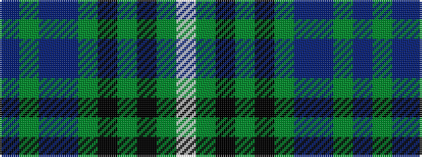

BGBBGKGKGW

It is a 10 stripe tartan.

<figure class="pat-woven">

<figcaption>idealised sample</figcaption>
</figure>

## Colour Sequence



## Tartans with this colour sequence

| Tartans |
|---------------|
| [O'Connell, William (Name)](/variants/s10/db19g7db7t2g20k9g6k4g10w3~x2/)|
||
