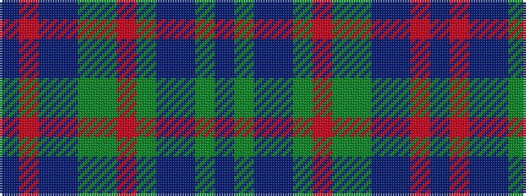

BGBBGRGGBBRB

It is a 12 stripe tartan.

<figure class="pat-woven">

<figcaption>idealised sample</figcaption>
</figure>

## Colour Sequence



## Tartans with this colour sequence

| Tartans |
|---------------|
| [Bowhunter (Fashion)](/setts/s12/dp3y10dp2db25dy3o4dy3g10db3dp2o3dp1~x2/)|
||
