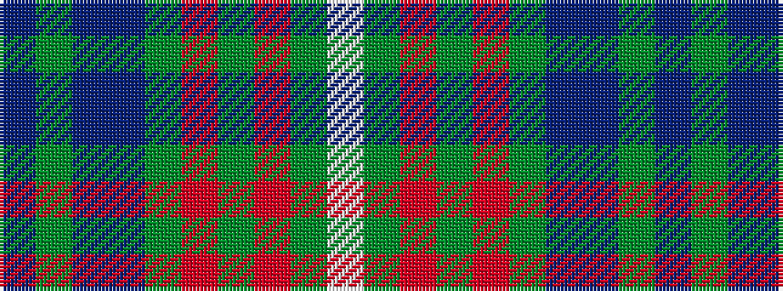

BGBBGRGRGW

It is a 10 stripe tartan.

<figure class="pat-woven">

<figcaption>idealised sample</figcaption>
</figure>

## Colour Sequence



## Tartans with this colour sequence

| Tartans |
|---------------|
| [MacConnell](/variants/s10/db22g6db5t2g22r6g5r4g9w3~x2/)|
||
