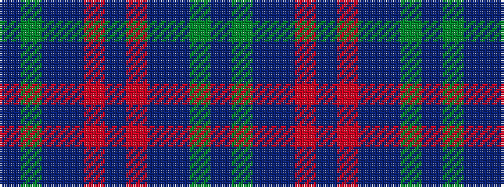

BGBBRBRBBGB

It is a 11 stripe tartan.

<figure class="pat-woven">

<figcaption>idealised sample</figcaption>
</figure>

## Colour Sequence



## Tartans with this colour sequence

| Tartans |
|---------------|
| [Gravesend Grammar School (Corp)](/setts/s11/db8g5db72db72m5db16m5db72db72g5db8/)|
||
