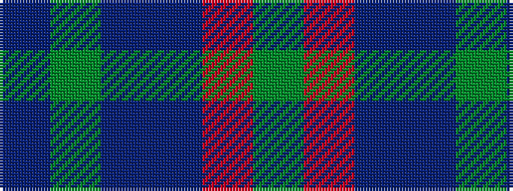

BGBBRG

It is a 6 stripe tartan.

<figure class="pat-woven">

<figcaption>idealised sample</figcaption>
</figure>

## Colour Sequence



## Tartans with this colour sequence

| Tartans |
|---------------|
| [Round Table (1997)](/variants/s6/db47dg14dp5do2r3dg7~x2/)|
||
