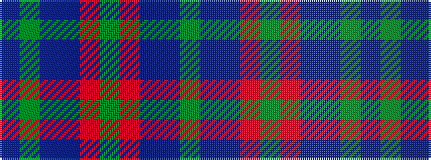

BGBBRGRBBG

It is a 10 stripe tartan.

<figure class="pat-woven">

<figcaption>idealised sample</figcaption>
</figure>

## Colour Sequence



## Tartans with this colour sequence

| Tartans |
|---------------|
| [Round Table of Britain and Ire Corporate Tartan](/variants/s10/db47dg14dp5do2r3dg7~x2/)|
||
