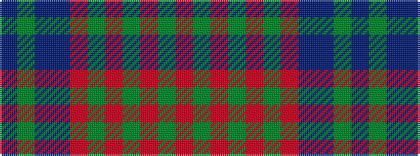

BGBBRGRGRGR

It is a 11 stripe tartan.

<figure class="pat-woven">

<figcaption>idealised sample</figcaption>
</figure>

## Colour Sequence



## Tartans with this colour sequence

| Tartans |
|---------------|
| [MacDougal 4](/setts/s11/p4g8db6p8r6g2r2g2r24g1r3~x2/)|
||
| [MacDougall](/setts/s11/dp4dg8db6dp8r6dg2r2dg2r24dg1r3~x2/)|
||
| [MacDougall VS](/setts/s11/dp4dg8db6dp8r6dg2r2dg2r24dg1r3/)|
||
| [MacDougall VS](/setts/s11/n4dg8db6n8r6dg2r2dg2r24dg1r3~x2/)|
||
| [MacDougall VS](/setts/s11/n4dg8db6n8r6dg2r2dg2r24dg1r3/)|
||
