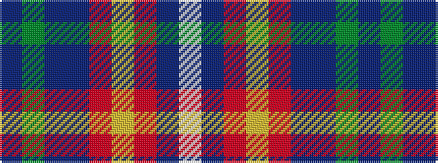

BGBBRYRBW

It is a 9 stripe tartan.

<figure class="pat-woven">

<figcaption>idealised sample</figcaption>
</figure>

## Colour Sequence



## Tartans with this colour sequence

| Tartans |
|---------------|
| [Bains of Caithness](/variants/s9/db3g6db2b11r3ly4r3b28w3~x2/)|
||
