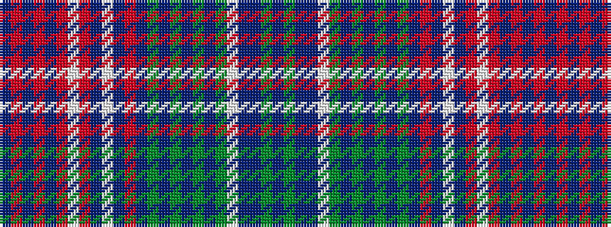

BGBBWGBGBGBGBRBWBRWRBRBRB

It is a 25 stripe tartan.

<figure class="pat-woven">

<figcaption>idealised sample</figcaption>
</figure>

## Colour Sequence



## Tartans with this colour sequence

| Tartans |
|---------------|
| [Unidentified Plaid #11](/variants/s25/db2r2db2r2db6r5w2r75db13w5db9ri2db45dy1db3dy2db2dy3db1dy10w2db10t2dy14t2~x2/)|
||
