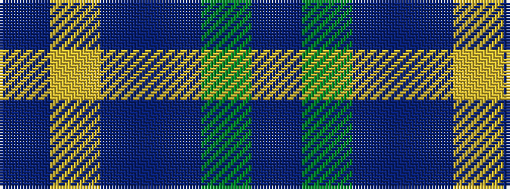

BGBBYB

It is a 6 stripe tartan.

<figure class="pat-woven">

<figcaption>idealised sample</figcaption>
</figure>

## Colour Sequence



## Tartans with this colour sequence

| Tartans |
|---------------|
| [Discover Islay (District)](/variants/s6/dp6ly1dp20db6g19dp2~x4/)|
||
