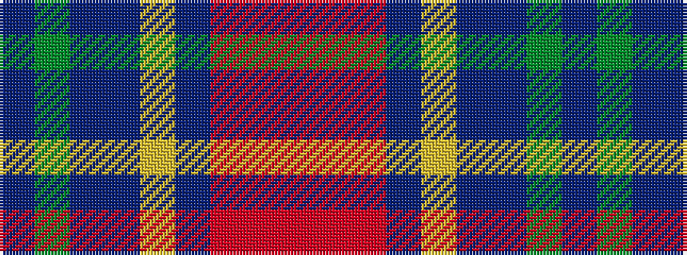

BGBBYBRRR

It is a 9 stripe tartan.

<figure class="pat-woven">

<figcaption>idealised sample</figcaption>
</figure>

## Colour Sequence



## Tartans with this colour sequence

| Tartans |
|---------------|
| [Hogeboom (Personal)](/setts/s9/t4g3t9dt14ly8dt2r35r2r3~x2/)|
||
