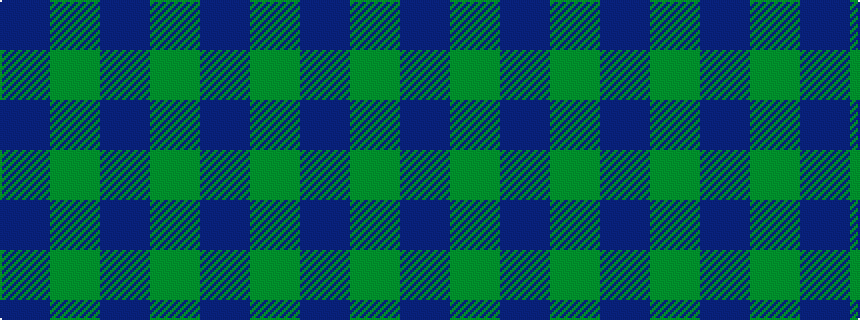

BGBG

It is a [4 stripe pattern](/stripes/stripes4/) — every 4-stripe pattern is gathered there.

<figure class="pat-woven">

<figcaption>idealised sample</figcaption>
</figure>

## Colour Sequence



## Tartans with this colour sequence

This pattern is a design lineage: every tartan below shares one colour order, whatever its owner —
near-identical designs are grouped, the largest lineage first (#112: the pattern is a tartan's
second parent, beside its family or clan).

<table class="sett-table">
<tbody>
<tr><td><a href="/tartans/w/wi/wilson-s-no-211/">Wilson's No 211</a></td></tr>
<tr><td class="sett-swatch"></td></tr>
<tr><td><a href="/tartans/w/wi/wilson-s-no-211-2/">Wilson's No.211</a> <small class="dt">ΔTartan 0.19</small></td></tr>
<tr><td class="sett-swatch"></td></tr>
<tr class="cluster-sep"><td></td></tr>
<tr><td><a href="/tartans/w/wa/walters/">Walters</a> <small class="dt">ΔTartan 1.77</small></td></tr>
<tr><td class="sett-swatch"></td></tr>
<tr class="cluster-sep"><td></td></tr>
<tr><td><a href="/tartans/b/ba/barwell/">Barwell</a> <small class="dt">ΔTartan 5.68</small></td></tr>
<tr><td class="sett-swatch"></td></tr>
</tbody>
</table>

