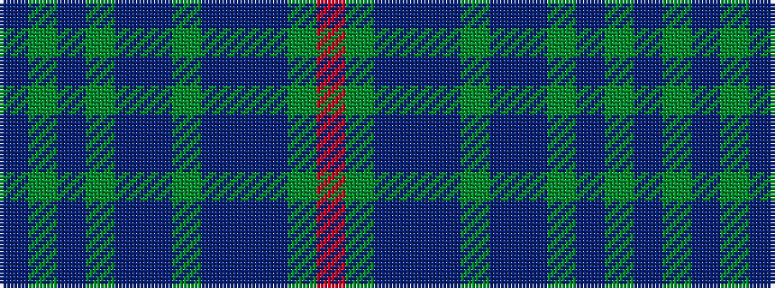

BGBGBBGBBBGR

It is a 12 stripe tartan.

<figure class="pat-woven">

<figcaption>idealised sample</figcaption>
</figure>

## Colour Sequence



## Tartans with this colour sequence

| Tartans |
|---------------|
| [Richard of Wales](/variants/s12/db5dg2db2dg2db2dt5dg2dt1t1dt1dg10r3~x4/)|
||
