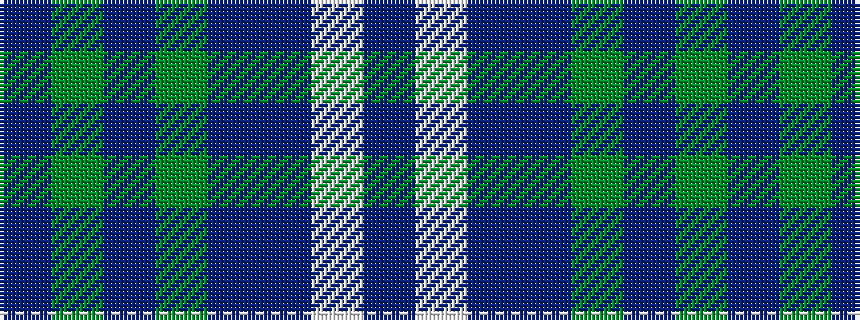

BGBGBBWB

It is a 8 stripe tartan.

<figure class="pat-woven">

<figcaption>idealised sample</figcaption>
</figure>

## Colour Sequence



## Tartans with this colour sequence

| Tartans |
|---------------|
| [Clans of Caledonia](/setts/s8/db4g5dp3g5db46dp42w4dp4/)|
||
