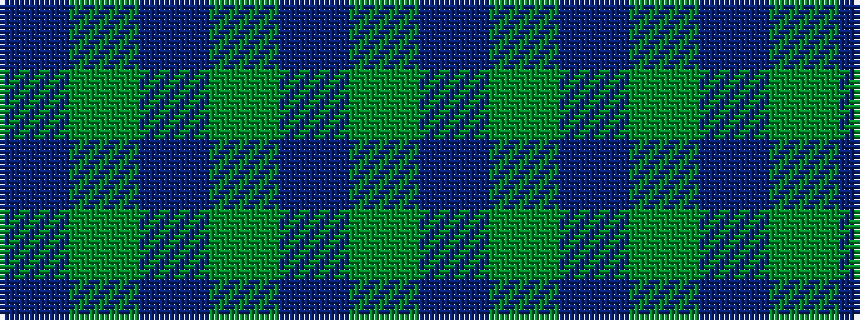

BGBGBGB

It is a 7 stripe tartan.

<figure class="pat-woven">

<figcaption>idealised sample</figcaption>
</figure>

## Colour Sequence



## Tartans with this colour sequence

| Tartans |
|---------------|
| [Unidentified #6](/variants/s7/db4dg3db2dg19t24dg1t2~x2/)|
||
| [Unidentified 1](/variants/s7/db4g3db2g19t24g1t2~x2/)|
||
