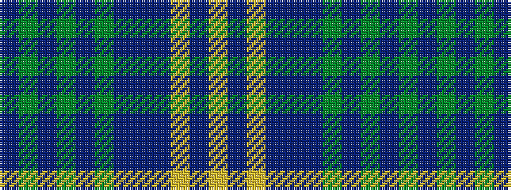

BGBGBGBBBYBY

It is a 12 stripe tartan.

<figure class="pat-woven">

<figcaption>idealised sample</figcaption>
</figure>

## Colour Sequence



## Tartans with this colour sequence

| Tartans |
|---------------|
| [California Burns (Personal)](/setts/s12/dr3g3dt3g14dt3g3dt3t5dt18ly2dt8ly2~x2/)|
||
