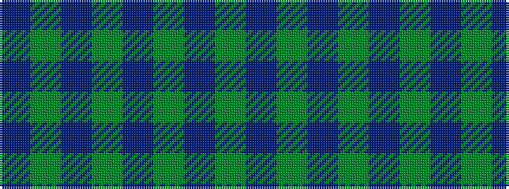

BGBGBGBG

It is a 8 stripe tartan.

<figure class="pat-woven">

<figcaption>idealised sample</figcaption>
</figure>

## Colour Sequence



## Tartans with this colour sequence

| Tartans |
|---------------|
| [Hebridean Cairn Fashion Tartan Tartan Number: 6822. Earliest known date: 2005 For a new House of Edgar Collection in wedding gray. See products available Copyright © Blair Urquhart, Comrie, 2015](/setts/s8/n2y3n3y3n10y2n18y1~x4/)|
||
| [Lochleven (Dance)](/setts/s8/db48dg6db3dg6db6dg4db2dg10~x2/)|
||
