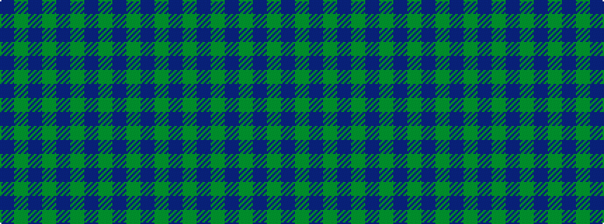

BGBGBGBGBG

It is a 10 stripe tartan.

<figure class="pat-woven">

<figcaption>idealised sample</figcaption>
</figure>

## Colour Sequence



## Tartans with this colour sequence

| Tartans |
|---------------|
| [Inkster](/variants/s10/g25db10dy3db2dy2db6~x2/)|
||
