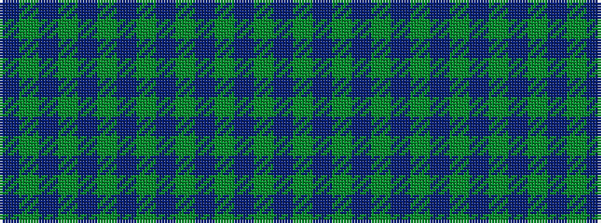

BGBGBGBGBGBGBG

It is a 14 stripe tartan.

<figure class="pat-woven">

<figcaption>idealised sample</figcaption>
</figure>

## Colour Sequence



## Tartans with this colour sequence

| Tartans |
|---------------|
| [Unidentified Plaid](/setts/s14/dr48dg13dr2dg7dr2dg7dr2dg11dr50y11dr2y7dr2y7~x2/)|
||
