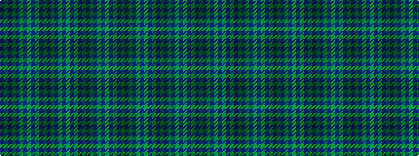

BGBGBGBGBGBGBGBGBGBGBGBGBGB

It is a 27 stripe tartan.

<figure class="pat-woven">

<figcaption>idealised sample</figcaption>
</figure>

## Colour Sequence



## Tartans with this colour sequence

This pattern is a design lineage: every tartan below shares one colour order, whatever its owner —
near-identical designs are grouped, the largest lineage first (#112: the pattern is a tartan's
second parent, beside its family or clan).

<table class="sett-table">
<tbody>
<tr><td><a href="/variants/s27/dp14g3dp14g14dp3g3dp3g14dp16g3dp16g14dp1g1dp2g1dp1g14dp1g1dp2g1dp1g14dp14g3dp14~x2/">MacRae (Rae)</a></td></tr>
<tr><td class="sett-swatch"></td></tr>
<tr><td><a href="/variants/s27/dp27g6dp27g28dp5g7dp5g28dp31g6dp31g28dp2g2dp4g2dp2g28dp2g2dp4g2dp2g28dp27g6dp27~x2/">MacRae/Rae</a></td></tr>
<tr><td class="sett-swatch"></td></tr>
<tr><td><a href="/variants/s27/dp27dg12dp54dg56dp10dg14dp10dg56dp62dg12dp62dg56dp4dg4dp8dg4dp4dg56dp4dg4dp8dg4dp4dg56dp54dg12dp27/">Rae (Wilsons) (Clan)</a></td></tr>
<tr><td class="sett-swatch"></td></tr>
</tbody>
</table>

