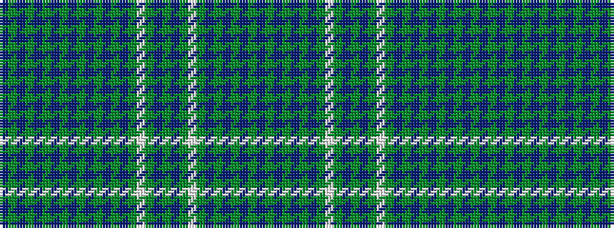

BGBGBGBGBGBGBGBGWGBGBGWGBGBGBGB

It is a 31 stripe tartan.

<figure class="pat-woven">

<figcaption>idealised sample</figcaption>
</figure>

## Colour Sequence



## Tartans with this colour sequence

| Tartans |
|---------------|
| [MacRae (MacCrae)](/setts/s31/dp25dg6dp25dg26dp5dg7dp5dg26w3dg7dp29dg6dp29dg7w3dg26dp2dg2dp4dg2dp2dg26dp2dg2dp4dg2dp2dg26dp25dg6dp25~x2/)|
||
| [MacRae, (MacCrae)](/setts/s31/p25g6p25g26p5g7p5g26w3g7p29g6p29g7w3g26p2g2p4g2p2g26p2g2p4g2p2g26p25g6p25~x2/)|
||
