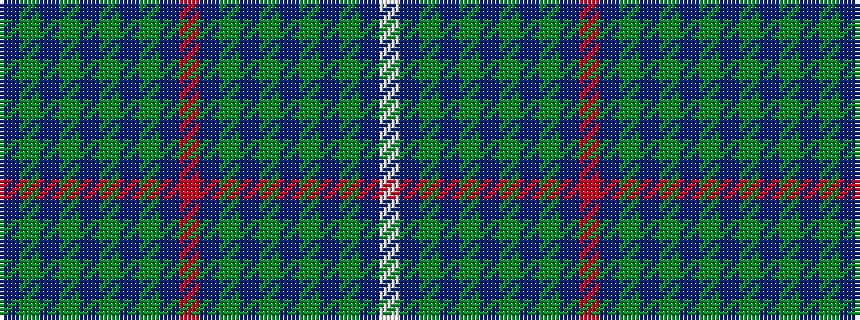

BGBGBGBGBRBGBGBGBGBW

It is a 20 stripe tartan.

<figure class="pat-woven">

<figcaption>idealised sample</figcaption>
</figure>

## Colour Sequence



## Tartans with this colour sequence

| Tartans |
|---------------|
| [Solway Spirit](/setts/s20/dp40g2dp2g2dp2g2dp3g16db15m3db15g16dp3g2dp2g2dp2g2dp40w4~x2/)|
||
