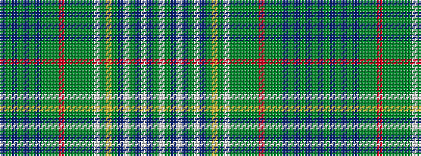

BGBGBGBGGGRGGGGGWGYGBWGBWBGW

It is a 28 stripe tartan.

<figure class="pat-woven">

<figcaption>idealised sample</figcaption>
</figure>

## Colour Sequence



## Tartans with this colour sequence

| Tartans |
|---------------|
| [Unidentified Plaid #9](/setts/s28/w70dy7db7w7db7dy7w7db5dy9ly4dy3w4dy3dg13dy70dg30dy4r10dy4dg30dy15db4dy4db4dy4db27dg6db27~x2/)|
||
