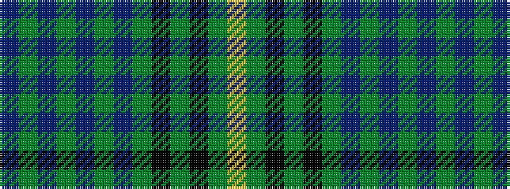

BGBGBGBGKGKGY

It is a 13 stripe tartan.

<figure class="pat-woven">

<figcaption>idealised sample</figcaption>
</figure>

## Colour Sequence



## Tartans with this colour sequence

| Tartans |
|---------------|
| [Princess Beatrice Hunting](/setts/s13/dbi10g5dbi5g60dbi13g10db67g5k5g5k5g13ly10/)|
||
