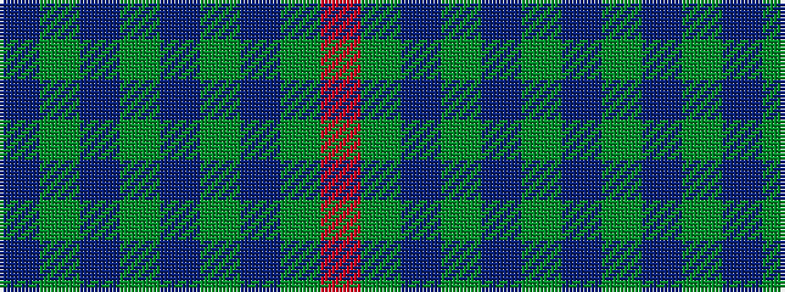

BGBGBGBGR

It is a 9 stripe tartan.

<figure class="pat-woven">

<figcaption>idealised sample</figcaption>
</figure>

## Colour Sequence



## Tartans with this colour sequence

| Tartans |
|---------------|
| [Burt Family](/setts/s9/dp2g13db8g3db33dy3db8dy13r2~x2/)|
||
