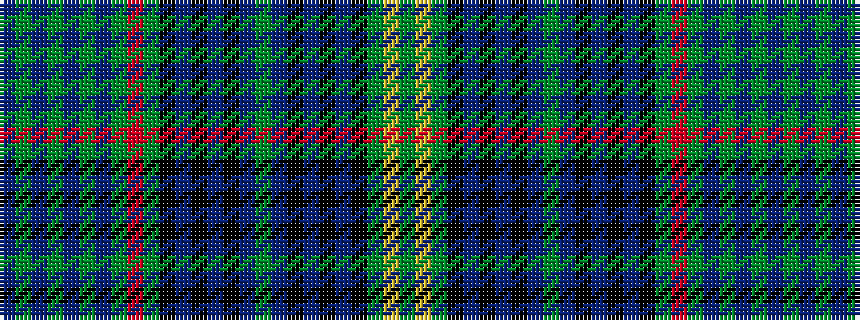

BGBGBGBGRGKBKBKBGBKBKBKGYG

It is a 26 stripe tartan.

<figure class="pat-woven">

<figcaption>idealised sample</figcaption>
</figure>

## Colour Sequence



## Tartans with this colour sequence

| Tartans |
|---------------|
| [Stewart Hunting](/variants/s26/g37ly3g37k9db4k2db3k2db31g4db31k2db3k2db4k9g37r3g37db9g4db31g4db31g4db9/)|
||
| [Stuart/Stewart Hunting](/variants/s26/dg37ly3dg37k9db4k2db3k2db31dg4db31k2db3k2db4k9dg37r3dg37db9dg4db31dg4db31dg4db9/)|
||
