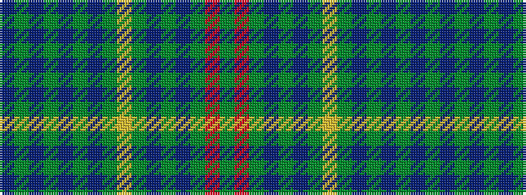

BGBGBGBGYGBGBGRG

It is a 16 stripe tartan.

<figure class="pat-woven">

<figcaption>idealised sample</figcaption>
</figure>

## Colour Sequence



## Tartans with this colour sequence

| Tartans |
|---------------|
| [Jubilee](/variants/s16/g17r3g17t19g3t19g17ly3g17t5g4t10g3t10g4t5/)|
||
