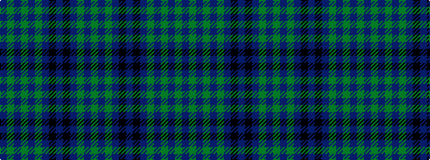

BGBGBGBKBKBGBG

It is a 14 stripe tartan.

<figure class="pat-woven">

<figcaption>idealised sample</figcaption>
</figure>

## Colour Sequence



## Tartans with this colour sequence

| Tartans |
|---------------|
| [Lochcarron of Scotland](/variants/s14/db2gi6dp1gi1dp1gi1db2k2db1k2db9g1db2g1~x4/)|
||
