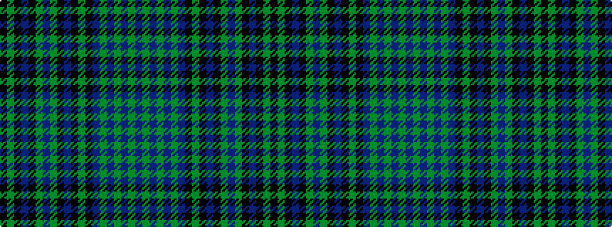

BGBGBGBKGKBKGBGKBKGK

It is a 20 stripe tartan.

<figure class="pat-woven">

<figcaption>idealised sample</figcaption>
</figure>

## Colour Sequence



## Tartans with this colour sequence

| Tartans |
|---------------|
| [Blackwater (Personal)](/variants/s20/k4g2k7n2k4g17n2g17k4n2k7g2k4n4g2n16g2n16g2n4~x2/)|
||
