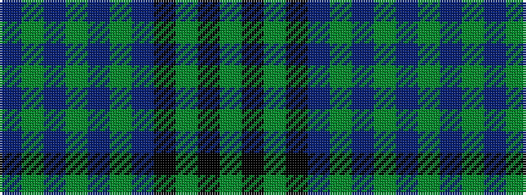

BGBGBGBKGKG

It is a 11 stripe tartan.

<figure class="pat-woven">

<figcaption>idealised sample</figcaption>
</figure>

## Colour Sequence



## Tartans with this colour sequence

| Tartans |
|---------------|
| [Rennie (Name)](/variants/s11/y6k1y28k24dp25y3dp3y3dp3y4dp3~x2/)|
||
