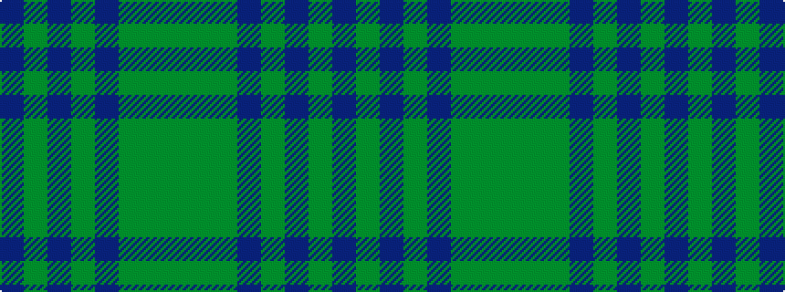

BGBGBGGG

It is a 8 stripe tartan.

<figure class="pat-woven">

<figcaption>idealised sample</figcaption>
</figure>

## Colour Sequence



## Tartans with this colour sequence

| Tartans |
|---------------|
| [Gammell (Brown) (Personal)](/setts/s8/db20dy2db2dy2db2dy6g15dy2~x2/)|
||
| [Universal Ancient](/setts/s8/t12dg2t2dg2t2dy8g8dy1~x2/)|
||
| [Universal Ancient International Tartan Tartan Number: 136. Earliest known date: Canada This design is different in warp and weft. The display gives the general appearance only. Produced to celebrate American tourism is Scotland. The colours are taken from the flags of the two nations and the Atlantic Ocean that separates them. See products available Copyright © Blair Urquhart, Comrie, 2015](/setts/s8/t12gi2t2gi2t2dy8g8dy1~x2/)|
||
