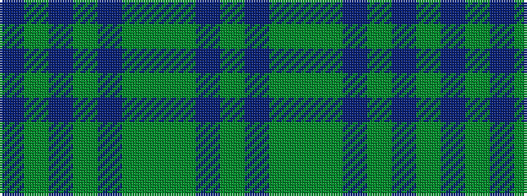

BGBGBGGGBG

It is a 10 stripe tartan.

<figure class="pat-woven">

<figcaption>idealised sample</figcaption>
</figure>

## Colour Sequence



## Tartans with this colour sequence

| Tartans |
|---------------|
| [Loch Lomond](/variants/s10/dp20dg4dp1dg4dp2y8dg1y8db26dg8~x2/)|
||
