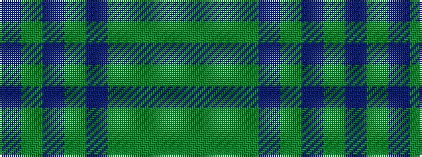

BGBGBGGGG

It is a 9 stripe tartan.

<figure class="pat-woven">

<figcaption>idealised sample</figcaption>
</figure>

## Colour Sequence



## Tartans with this colour sequence

| Tartans |
|---------------|
| [Manx Centenary](/variants/s9/db22g3db3g3db3g9y28g3y6~x2/)|
||
