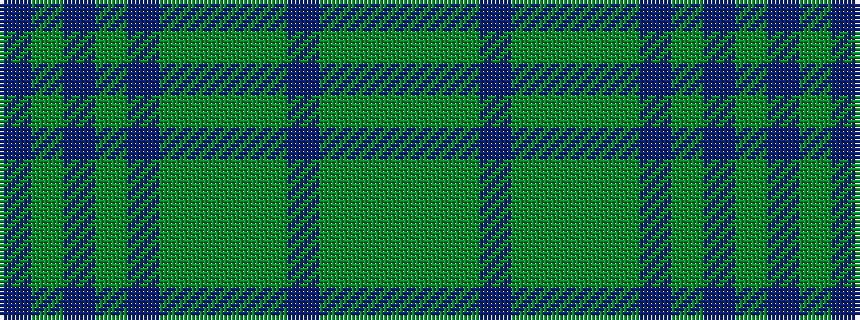

BGBGBGGGGBGGG

It is a 13 stripe tartan.

<figure class="pat-woven">

<figcaption>idealised sample</figcaption>
</figure>

## Colour Sequence



## Tartans with this colour sequence

| Tartans |
|---------------|
| [Coeur D'Alene Firefighters (Corporat](/variants/s13/g61g1g1db2g1g1g16g1db4g2db6g1db4~x2/)|
||
