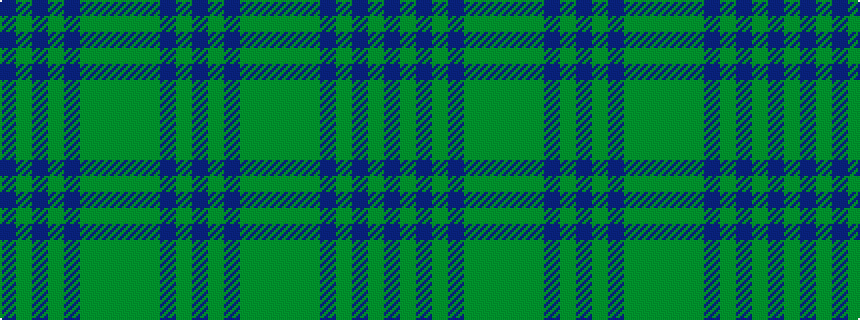

BGBGBGGGGGBGB

It is a 13 stripe tartan.

<figure class="pat-woven">

<figcaption>idealised sample</figcaption>
</figure>

## Colour Sequence



## Tartans with this colour sequence

| Tartans |
|---------------|
| [Montmorency Family Tartan](/variants/s13/db21g2db3g2db2g14dy15g4dy15g14db14g2db3~x2/)|
||
| [Tyneside Scottish (Blue)](/variants/s13/b8dy1b1dy1b1dy8g8dy1g8dy8b8dy1b1~x6/)|
||
| [Tyneside Scottish Purple (Mil/Distr)](/variants/s13/dp8dy1dp1dy1dp1dy8g8dy1g8dy8dp8dy1dp1~x6/)|
||
