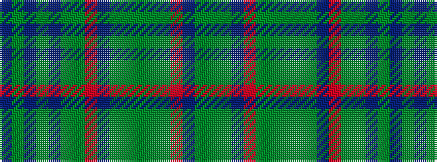

BGBGBGGRBGGGGGRBGG

It is a 18 stripe tartan.

<figure class="pat-woven">

<figcaption>idealised sample</figcaption>
</figure>

## Colour Sequence



## Tartans with this colour sequence

| Tartans |
|---------------|
| [Nova Scotia](/variants/s18/g10dg2db2o14dg2g2dg2g2dg2db25o8g4dg4db3dg1db3dg1db4~x2/)|
||
