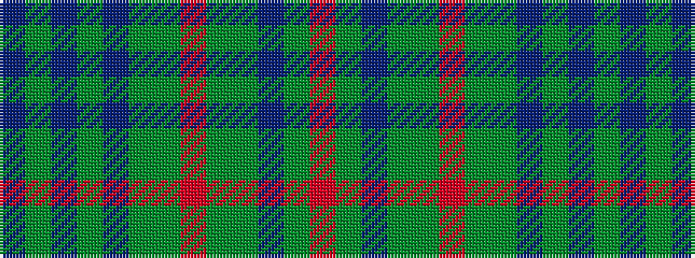

BGBGBGGRGGBGR

It is a 13 stripe tartan.

<figure class="pat-woven">

<figcaption>idealised sample</figcaption>
</figure>

## Colour Sequence



## Tartans with this colour sequence

| Tartans |
|---------------|
| [Murray of Atholl](/variants/s13/db18dy4db3dy3db3dy18g18r10g18dy18db18dy3r10~x2/)|
||
