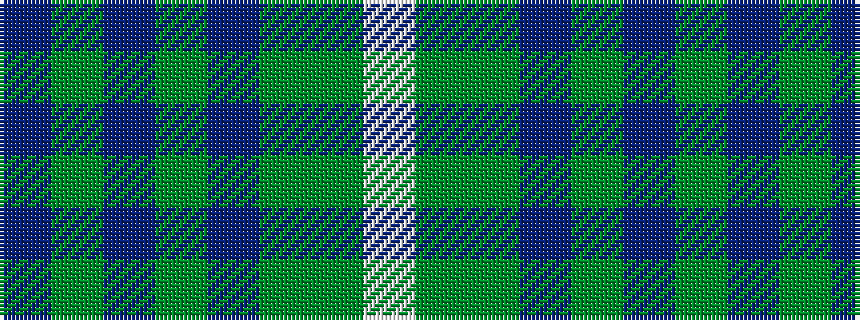

BGBGBGGW

It is a 8 stripe tartan.

<figure class="pat-woven">

<figcaption>idealised sample</figcaption>
</figure>

## Colour Sequence



## Tartans with this colour sequence

| Tartans |
|---------------|
| [Lamont #2](/variants/s8/dp11dy2dp2dy2dp2dy11dg14w2~x2/)|
||
