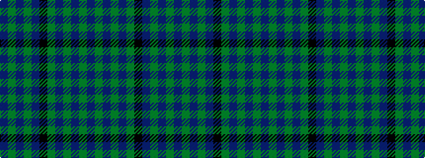

BGBGBGKBGBGB

It is a 12 stripe tartan.

<figure class="pat-woven">

<figcaption>idealised sample</figcaption>
</figure>

## Colour Sequence



## Tartans with this colour sequence

| Tartans |
|---------------|
| [Stephen-Mathieson](/variants/s12/db16g1db1g1db1k12g1db1g1db1g6dp2~x4/)|
||
