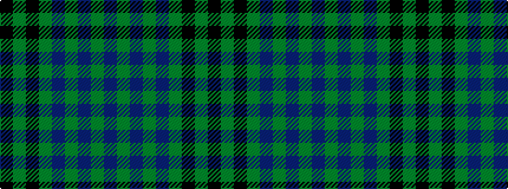

BGBGBGKGK

It is a 9 stripe tartan.

<figure class="pat-woven">

<figcaption>idealised sample</figcaption>
</figure>

## Colour Sequence



## Tartans with this colour sequence

| Tartans |
|---------------|
| [Carlow Irish County Tartan](/variants/s9/dp20dg2dp2dg2dp2dg8k24dg2k3~x2/)|
||
| [Carlow, County](/variants/s9/dr20g2dr2g2dr2g8k24g2k3~x2/)|
||
