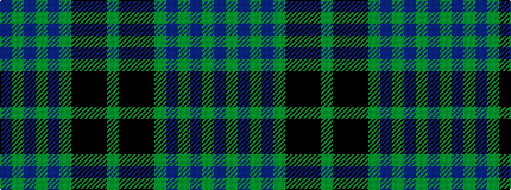

BGBGBGKKKG

It is a 10 stripe tartan.

<figure class="pat-woven">

<figcaption>idealised sample</figcaption>
</figure>

## Colour Sequence



## Tartans with this colour sequence

| Tartans |
|---------------|
| [Hueg (Bavaria) Hunting (Personal)](/setts/s10/dp17dg5dp5dg17dp4dg17ki2k2ki2dg5~x2/)|
||
