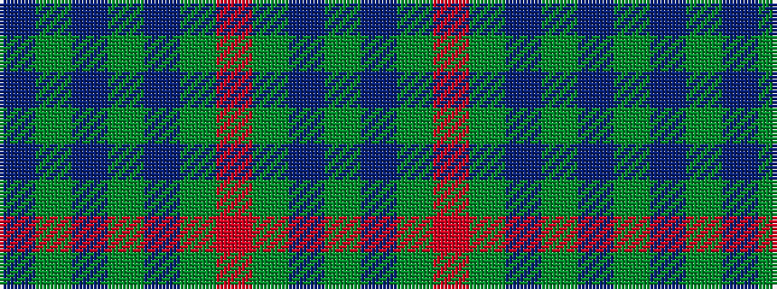

BGBGBGRGBG

It is a 10 stripe tartan.

<figure class="pat-woven">

<figcaption>idealised sample</figcaption>
</figure>

## Colour Sequence



## Tartans with this colour sequence

| Tartans |
|---------------|
| [Owen Welsh Name Tartan](/variants/s10/g3dt1g2r1g3db3g2db2g18dt2~x2/)|
||
