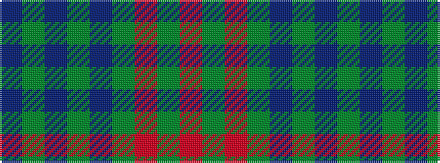

BGBGBGRGR

It is a 9 stripe tartan.

<figure class="pat-woven">

<figcaption>idealised sample</figcaption>
</figure>

## Colour Sequence



## Tartans with this colour sequence

| Tartans |
|---------------|
| [Lawlis/Lawless](/variants/s9/db10dg1db1dg1db1dg2r12dg1r2~x4/)|
||
| [Manx Centenary](/variants/s9/t22g3t3g3t3g9o28g3o6~x2/)|
||
| [Manx Centenary District Tartan](/variants/s9/db22g3db3g3db3g9o28g3o6~x2/)|
||
