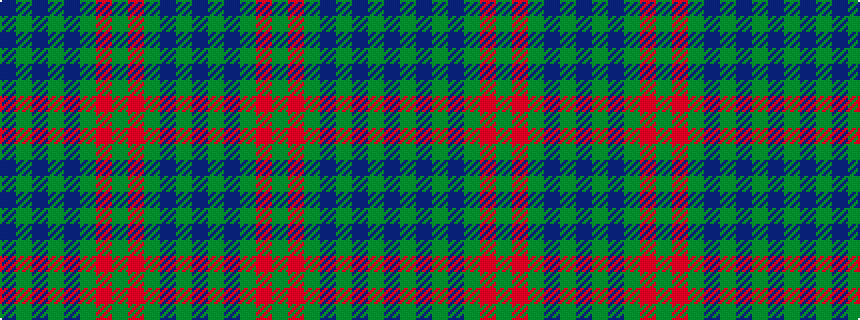

BGBGBGRGRGBGB

It is a 13 stripe tartan.

<figure class="pat-woven">

<figcaption>idealised sample</figcaption>
</figure>

## Colour Sequence



## Tartans with this colour sequence

| Tartans |
|---------------|
| [Montmorency](/variants/s13/db21g2db3g2db2g14o15g4o15g14db14g2db3~x2/)|
||
