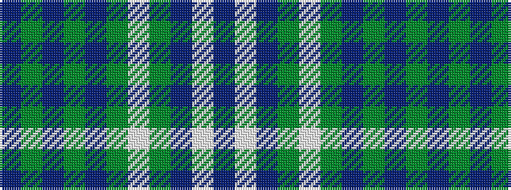

BGBGBGWGBWB

It is a 11 stripe tartan.

<figure class="pat-woven">

<figcaption>idealised sample</figcaption>
</figure>

## Colour Sequence



## Tartans with this colour sequence

| Tartans |
|---------------|
| [Chalk (Personal)](/variants/s11/dt2w5dt5y11w5dg12t1dg2t26dg2dt2~x2/)|
||
