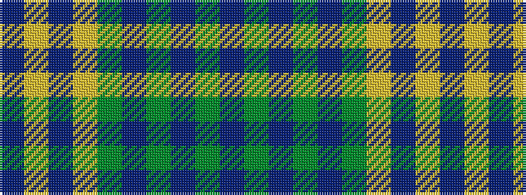

BGBGBGYBYB

It is a 10 stripe tartan.

<figure class="pat-woven">

<figcaption>idealised sample</figcaption>
</figure>

## Colour Sequence



## Tartans with this colour sequence

| Tartans |
|---------------|
| [Rice (Welsh Name)](/variants/s10/dt4lo21dt1lo21y8db4y5db4y4dt4/)|
||
