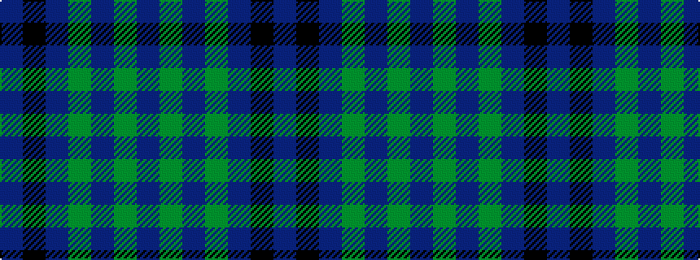

BGBGBKB

It is a 7 stripe tartan.

<figure class="pat-woven">

<figcaption>idealised sample</figcaption>
</figure>

## Colour Sequence



## Tartans with this colour sequence

| Tartans |
|---------------|
| [Lawrie](/variants/s7/dp6y2dp1g25db16k2db4~x2/)|
||
