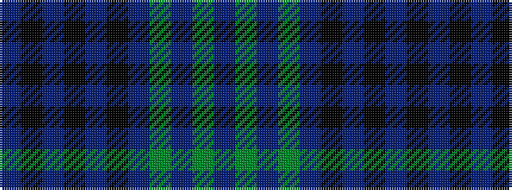

BGBGBKBKBKB

It is a 11 stripe tartan.

<figure class="pat-woven">

<figcaption>idealised sample</figcaption>
</figure>

## Colour Sequence



## Tartans with this colour sequence

| Tartans |
|---------------|
| [Wcwm 1893-2](/variants/s11/n6k1n2k2n1k4db10dy4dp1dy3b1~x4/)|
||
