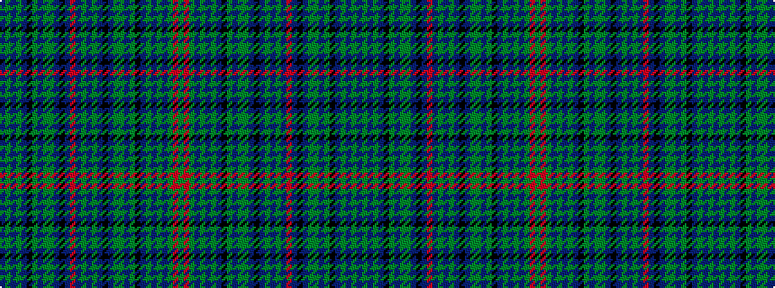

BGBGBKGBGGBKBRBGBGBKBGGBGKBGBGBGRG

It is a 34 stripe tartan.

<figure class="pat-woven">

<figcaption>idealised sample</figcaption>
</figure>

## Colour Sequence



## Tartans with this colour sequence

This pattern is a design lineage: every tartan below shares one colour order, whatever its owner —
near-identical designs are grouped, the largest lineage first (#112: the pattern is a tartan's
second parent, beside its family or clan).

<table class="sett-table">
<tbody>
<tr><td><a href="/variants/s34/dg3r3dg3db3g13db5g3db5k9dg3db3dg3g6db3k3db16y3db3dg3db3r3db16k3db3g6dg3db3dg3k9db5g3db5g13db3~x2/">Shipley, Ian (Personal)</a></td></tr>
<tr><td class="sett-swatch"></td></tr>
</tbody>
</table>

