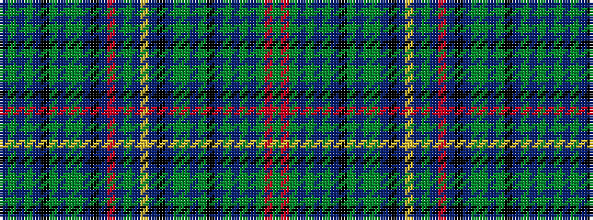

BGBGBKGBGGBKBRBGBYBKBGGBGKBGBGBGRG

It is a 34 stripe tartan.

<figure class="pat-woven">

<figcaption>idealised sample</figcaption>
</figure>

## Colour Sequence



## Tartans with this colour sequence

| Tartans |
|---------------|
| [Shipley, Ian (Personal)](/setts/s34/g3r3g3t3gi13t5gi3t5k9g3t3g3gi6t3k3t16ly3t3g3t3r3t16k3t3gi6g3t3g3k9t5gi3t5gi13t3~x2/)|
||
